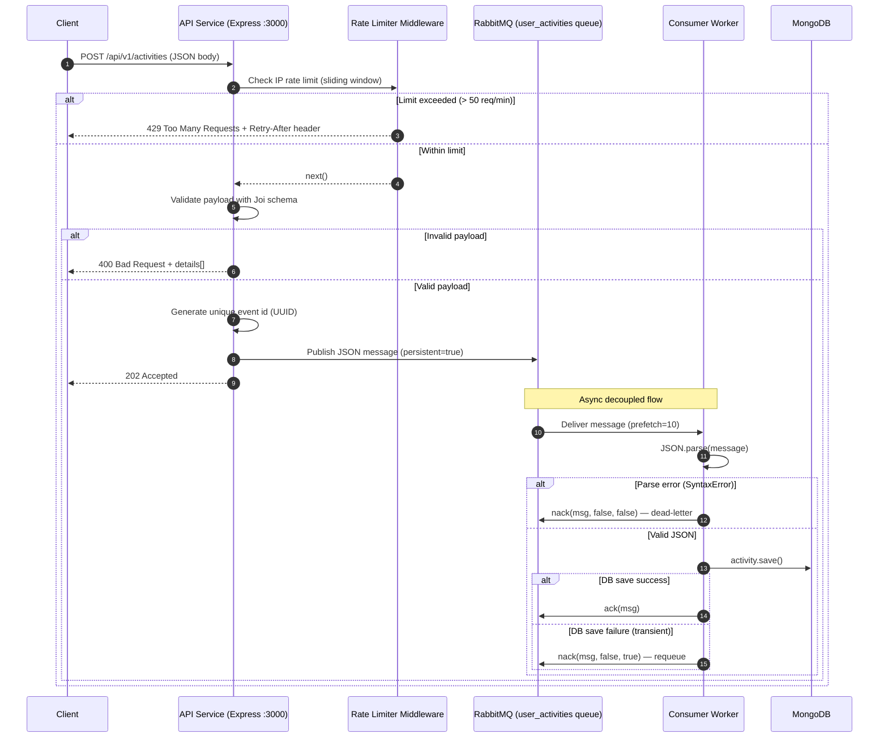
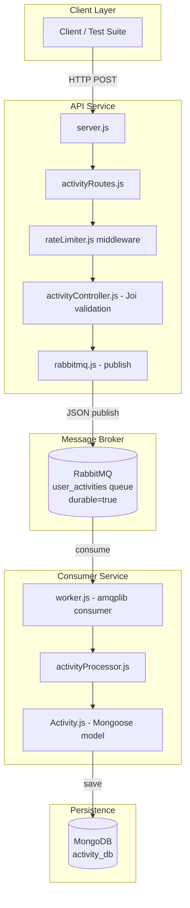

# Architecture — User Activity Service

## System Design

This service follows an **event-driven microservice** pattern. The API and Consumer are fully decoupled through RabbitMQ, allowing each to scale independently and ensuring that a consumer outage does not affect the API's ability to accept events.

---

## Request Lifecycle — Sequence Diagram



---

## Component Diagram



---

## Message Format

Messages published to RabbitMQ have the following structure:

```json
{
  "id": "550e8400-e29b-41d4-a716-446655440000",
  "userId": "a1b2c3d4-e5f6-7890-1234-567890abcdef",
  "eventType": "user_login",
  "timestamp": "2023-10-27T10:00:00.000Z",
  "payload": {
    "ipAddress": "192.168.1.1",
    "device": "desktop",
    "browser": "Chrome"
  }
}
```

> The `id` field is generated by the API service at ingestion time using `crypto.randomUUID()`. This enables idempotent consumer processing.

---

## Database Schema

```
Collection: activities

{
  id:          String  (UUID, unique, indexed)   — event identity
  userId:      String  (indexed)                 — which user
  eventType:   String                            — type of event
  timestamp:   Date                              — when event occurred
  processedAt: Date    (default: now)            — when consumer saved it
  payload:     Mixed                             — arbitrary event data
}
```

---

## Rate Limiting Algorithm — Sliding Window Log

Unlike a fixed window (which allows burst attacks at window boundaries), the sliding window log maintains a list of request timestamps per IP. On each request:

1. Filter out timestamps older than `windowMs` (60 seconds)
2. If remaining count ≥ `maxRequests` → reject with 429
3. Otherwise → push current timestamp, allow request

This guarantees that at **no point in time** can a client send more than 50 requests in any 60-second rolling window.

```
Timeline:  0s────────────────────────────60s──────────────────120s
           [req1, req2 ... req50]              [window slides forward]
                        [req51 → BLOCKED]
```

---

## Error Handling Strategy

| Layer | Error Type | Action |
|---|---|---|
| API | Invalid JSON payload | 400 Bad Request + `details[]` |
| API | RabbitMQ publish failure | 500 Internal Server Error |
| API | Rate limit exceeded | 429 Too Many Requests + `Retry-After` |
| Consumer | Malformed JSON (`SyntaxError`) | `nack` without requeue → dead-letter |
| Consumer | DB save failure (transient) | `nack` with requeue → retry |
| Consumer | RabbitMQ connection drop | Reconnect after 5s with `connection.on('close')` |

---

## Scalability Considerations

- **Horizontal API scaling**: The sliding window rate limiter uses in-memory state. For multiple API instances, replace with a **Redis-backed** rate limiter (e.g., `rate-limiter-flexible` with Redis store).
- **Consumer parallelism**: `channel.prefetch(10)` limits concurrent message processing per worker instance. Scale consumers horizontally by running multiple container replicas — RabbitMQ distributes messages via round-robin.
- **Queue durability**: Both `durable: true` queue and `persistent: true` messages ensure no data loss on broker restarts.
